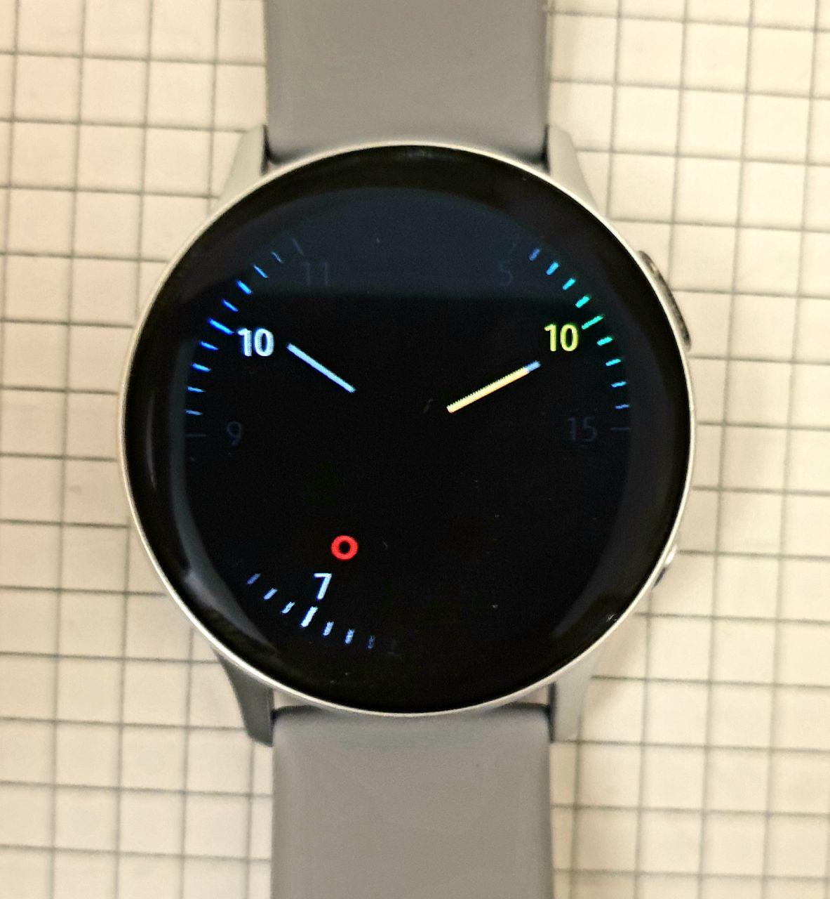
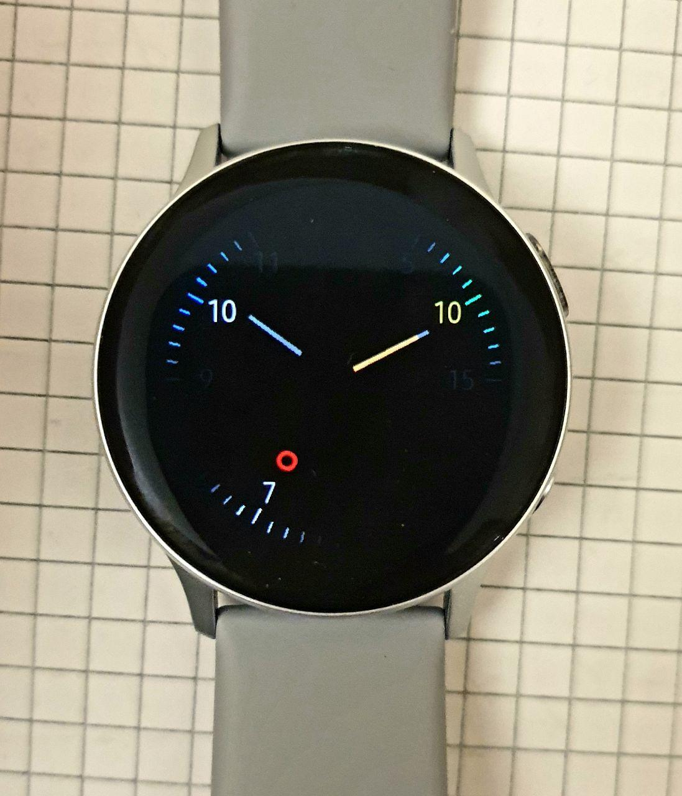

# ShadowFace-Tizen232
The battery friendly analog watchface designed for tizen devices  

Pictures
--- 
Notice the feature **"weekly shrinking"**  
Maximum expansion on sundays, maximum contraption on saturdays (configurable)  
**Sunday**  
  
**Saturday**  
   

# Features, Objectives & FAQ
*Why this watchface is different?*  
Like the Wear OS version, I had a couple reasons to code my own watchface:  
* Know the sources
* Optimize code for minimum battery usage
* Have an **analog** watchface
* Avoid **burn-in**  

**Features**
* **STRONG** burn-in protection:  
* - Disappearing clock ticks  
* - Weekly shrinking  
* - Low pixel on ratio design with strategical item positions  
combined with the system standard protection make this watchface a good candidate for the safest ones on earth  
* Battery bar as minutes watch hand.  Would you still notice without knowing it?
* **Faster reading** with the digital **fused** with analog.  
Some say the two aren't married, in fact why would you have both clearly visible?  
With hours as hours, minutes as minutes, seconds as seconds, you get both. All on the analog.
* **Even Faster reading** with the right colors.  
The closest minute is highlighted too!
* Further dim Always On Display mode (*can be set in project files*)
* Ticking sound! (*a total of 4 different sounds is available as of 17/04/2020*)
* The design is also grayscale-friendly

*If you wanted a battery friendly watchface, why aren't you just using a plain digital one?*  
I have a round watch.  

*Why is this unavailable on the store?*  
Unfortunately it is closed for new watchface developers at the moment.  
~Will re-attempt on August, 2020~
Unfortunately installing through this repository is mandatory. Guess why

*How can I install it?*  
Look no further than the following section

# Installing the watchface
Grab the tpk file under releases section and read the following.  
Here's a guide that should work for most tizen wearable devices.  
You will install the required tools then apply your signature (device dependent for tpk files) then install on device.  
https://www.reddit.com/r/GearS3/comments/aljplu/tutorial_how_to_install_tpks_and_wgts_onto_your/  
Also if you install Tizen Studio, you will be able to download the project and build it yourself.  
Furthermore, you'll be able to personalize it to your liking.  

*The content provided is to be considered for information purposes only.  
Editor and contributors decline any responsibility for issues or damage.*  
For code-related issues please make use of the right section.  
You may not distribute paid builds from this project or derivatives.
